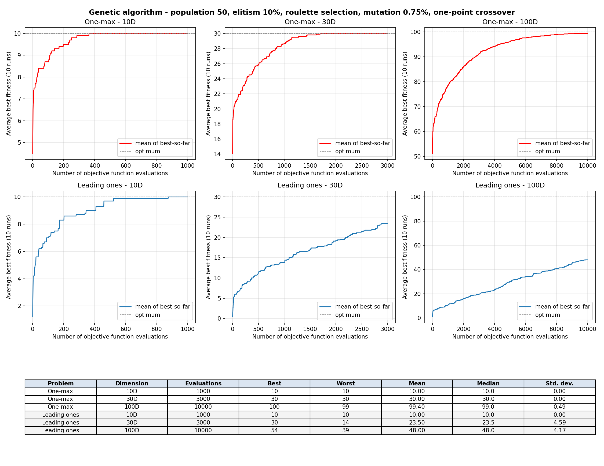

# AP9EV excercise 1

Project for the Evolutionary Computation Techniques class. First assignment.

Author: [Ondřej Hruboš](https://github.com/hruboson), [Github repository](https://github.com/hruboson/AP9EVex1)
# Results

 The graph was generated for configuration:

```python
RUNS_NO = 10
MUTATION_PROBABILITY = 0.0075
POPULATION_SIZE = 50
ELITISM_RATIO = 0.1
SELECTION = "roulette" # "rank", "roulette"
EVALS_PER_DIM = 100
DIMENSIONS = (10, 30, 100)

SEED = 42
```




# Usage

You can tweak the parameters at the top of the script. All parameters are `CAPITALIZED`.

## Run

- Either use the prepared [`nix`](./shell.nix) shell file:
    - Install [`nix`](https://nixos.org/download/) on your system (currently only for Linux/MacOS)
    - Enter the shell: `nix-shell ./shell.nix`
    - Run the Python script: `python ./main.py`
- Use your own installation of **Python 3.14** (older versions will most likely not work due to the usage of type hints!)
    - Create a virtual environment with the attached [`requirements.txt`](./requirements.txt): 
        - Windows: `python -m venv .venv && .venv\\Scripts\\activate && pip install -r requirements.txt && python main.py`
        - Linux/MacOS: `python -m venv .venv && . .venv/bin/activate && pip install -r requirements.txt && python main.py`
    - Run the Python script: `python ./main.py`
    - Leave virtual environment: `deactivate`
